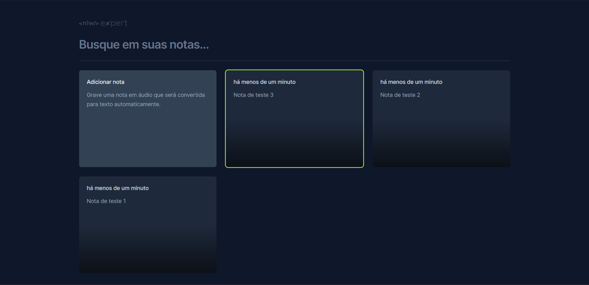

# Expert notes



## Índice

- [Pré-requisitos](#pré-requisitos)
- [Instalação](#instalação)
- [Utilização](#utilização)
- [Contribuição](#contribuição)
- [Créditos](#créditos)
- [Contato](#contato)

## Pré-requisitos

- Node.js (versão 12 ou superior)
- Npm

## Instalação

1. Clone o repositório para seu ambiente local:

```
git clone https://github.com/Wallauerr/expert-notes-react.git
```

2. Acesse o diretório do projeto:

```
cd expert-notes-react
```

3. Instale as dependências do projeto:

```
npm i
```

4. Inicie a aplicação:

```
npm run dev
```

5. A aplicação iniciará o navegador padrão. Caso isso não aconteça, acesse [http://localhost:5173](http://localhost:5173)

## Utilização

1. Adicione uma nota usando texto ou gravando um áudio (para a função áudio é recomendado usar chrome, edge ou safari).
2. Clique em "Salvar nota".
3. Caso desejar excluir alguma nota, clique em "apagar essa nota" .

## Contribuição

Apesar de ser um desafio para estudos contribuições são sempre bem-vindas! Siga as etapas abaixo para contribuir com este projeto:

1. Dê um fork neste repositório.
2. Crie uma nova branch com sua feature/correção:

```
git checkout -b nome-da-sua-branch
```

3. Realize as alterações e commits:

```
git commit -m "tipoDeModificação: Descrição das suas alterações"
```

Tipos de modificação: feat, fix, etc...

4. Envie as alterações para o fork do repositório:

```
git push origin nome-da-sua-branch
```

5. Abra um Pull Request neste repositório (original).

## Créditos

- [TypeScript](https://www.typescriptlang.org/)
- [React](https://react.dev/)
- [Tailwindcss](https://tailwindcss.com/)
- [Radix ui](https://www.radix-ui.com/)
- [Sonner](https://sonner.emilkowal.ski/)
- [Lucide icons](https://lucide.dev/)
- [Figma layout](https://www.figma.com/file/5L1y2GngB5oIV7iMf20baN/NLW-expert-%E2%80%A2-Notes-(Community)?type=design&node-id=2-287&mode=design&t=jxrYmZBgFslKdcBa-0)
- [Vite](https://vitejs.dev/)
- [Rocketseat](https://www.rocketseat.com.br/)

## Contato

Se tiver alguma dúvida ou sugestão, você pode entrar em contato comigo por meio do email: wallauer@protonmail.com
